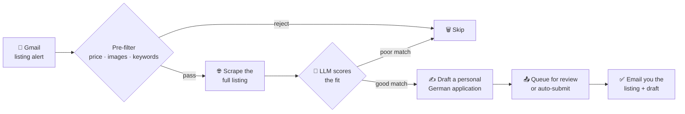

# 🏠 ImmoCheck

### Apply for Munich apartments before everyone else does.

Munich's rental market moves in minutes. The listings worth having collect hundreds of
applicants within hours, and the viewing usually goes to someone who applied early with a
clean, complete, German-language message. Doing that by hand means refreshing ImmoScout24
all day and pasting the same application over and over.

**ImmoCheck does it for you.** It watches your inbox for new listing alerts, reads each
apartment, decides whether it's actually a fit, writes a personalized application in German,
and puts it in front of the landlord — usually while you're doing something else.

It found me my flat. I don't need it anymore, so here it is. 🍻

> ⚠️ Personal-use project shared for educational purposes. Automating these platforms may
> violate their Terms of Service — use at your own risk. See the [Disclaimer](#disclaimer).

---

## What it does for you

- **⚡ Applies fast** — a new listing goes from inbox to a finished application in seconds, unattended.
- **🎯 Filters the noise** — an LLM scores every apartment against *your* profile, so you only hear about places actually worth your time.
- **✍️ Writes like you** — personalized German applications from your own template, tailored to each listing.
- **🔀 Covers three platforms** — ImmoScout24, WG-Gesucht, and immobilie1.de, all from one Gmail inbox.
- **🔒 Private and cheap** — runs entirely on your machine with your own API key (Gemini's free tier is plenty), or a fully local LLM via Ollama.
- **🖐️ Keeps you in control** — the recommended mode drafts each application and emails it to you to review and send yourself. Nothing goes out automatically.

## How it works



Everything runs locally on a loop: it polls Gmail every few minutes, and each new listing
flows through the pipeline above on its own. You just read the emails it sends you.

---

## Setup

You'll need **Python 3.10+**, **git**, and a **Gmail account**. Setup is one command.

### 1. Clone and run the wizard

```bash
git clone https://github.com/quzle/immocheck.git
cd immocheck
python setup.py
```

`setup.py` creates a virtual environment, installs everything (including the Chromium
browser Playwright needs), and walks you through an interactive wizard that writes your
config — no files to edit by hand. Re-run just the questions anytime with
`python setup.py --config-only`.

**Have these two things ready before you run it:**

| The wizard asks for | Where to get it |
|---|---|
| **Gmail app password** | [myaccount.google.com/apppasswords](https://myaccount.google.com/apppasswords) — requires 2-step verification. This is *not* your normal Gmail password. |
| **Gemini API key** *(free)* | [aistudio.google.com/apikey](https://aistudio.google.com/apikey) → **Create API key**. The free tier is plenty for a personal search. (Prefer Anthropic or a fully local model? The wizard offers both.) |

### 2. Tell it about you

The wizard creates `templates/renter_profile.txt` from a template — **edit it** with your
tenant details (age, job, income, why you're a good tenant). The LLM uses this to score
apartments and write your applications, so it's worth a few minutes. You can also adjust
`templates/application_template.txt` to set the tone of the German message.

> These files are gitignored, so your details never get committed. If they ever go missing,
> ImmoCheck recreates them from the `.example` templates on the next run.

### 3. Set up a Gmail label for your alerts

Create a Gmail label and a filter so listing alert emails land in it — that's the folder
ImmoCheck polls. The exact steps are in [Gmail setup](#gmail-setup) below. (The wizard asks
for the label name; the default is `ImmoScout`.)

### 4. Log in to ImmoScout24 once

ImmoCheck loads listing pages in its **own dedicated Chrome profile**, kept separate from
your everyday browser so both can run at once. Log in once and the session is reused:

```bash
source .venv/bin/activate      # Windows: .venv\Scripts\activate
python test_login.py
```

A browser window opens — log in to ImmoScout24. It saves the session automatically; repeat
only if ImmoScout24 logs you out.

### 5. First run

Safe defaults mean nothing is submitted automatically, so just start it:

```bash
python main.py
```

<details>
<summary>Prefer to set things up manually, without the wizard?</summary>

```bash
# 1. Virtual environment
python3 -m venv .venv
source .venv/bin/activate            # Windows: .venv\Scripts\activate

# 2. Dependencies
pip install -r requirements.txt
playwright install chromium

# 3. Config — copy the template and edit .env.local by hand
cp .env.example .env.local           # Windows: copy .env.example .env.local
```

Then edit `.env.local` (see `.env.example` for the full, commented list). The essentials:

| Variable | Description |
|---|---|
| `IMAP_EMAIL` | Gmail address that receives listing alerts |
| `IMAP_PASSWORD` | Gmail **app password** — [generate here](https://myaccount.google.com/apppasswords) (needs 2-step verification) |
| `IMAP_FOLDER` | Name of the Gmail label for ImmoScout24 emails |
| `GEMINI_API_KEY` | [Gemini API key](https://aistudio.google.com/apikey) (or set `ANTHROPIC_API_KEY` + `LLM_PROVIDER=anthropic`) |

Optionally set `OFFICE_LOCATION` and `TRANSIT_LINES` for commute-aware scoring. Then create
your profile files from the templates and fill them in:

```bash
cp templates/renter_profile.example.txt templates/renter_profile.txt
cp templates/application_template.example.txt templates/application_template.txt
cp templates/application_template_verbose.example.txt templates/application_template_verbose.txt
cp templates/applicant_form.example.json templates/applicant_form.json   # only for browser auto-submit
```

Finally, log in (`python test_login.py`) and run (`python main.py`).

</details>

---

## Gmail setup

ImmoCheck reads listing alerts from a Gmail label. Do this once, on the Gmail side:

1. Create a Gmail label (e.g. `ImmoScout`) for alert emails.
2. Add a Gmail filter to auto-label incoming alerts from ImmoScout24 (filter by sender: `noreply@immobilienscout24.de`).
3. Generate an app password at [myaccount.google.com/apppasswords](https://myaccount.google.com/apppasswords) (requires 2-step verification).

That's all you edit here — `setup.py` asks for the app password and the label name, so
have the label created and the app password copied before you run the wizard.

**Additional platforms (optional).** These aren't covered by the wizard. Create a separate
Gmail label per platform, filter its alerts into that label, and set the matching variable
in `.env.local`:

| Platform | Variable | Example label | Filter by sender |
|---|---|---|---|
| WG-Gesucht | `IMAP_WGGESUCHT_FOLDER` | `WG-Gesucht` | `noreply@wg-gesucht.de` |
| immobilie1.de | `IMAP_IMMOBILIE1_FOLDER` | `Immobilie1` | `noreply@immobilie1.de` |

Leave a variable blank to disable that platform. (immobilie1 alerts are sent via Brevo
with click-tracking links; the parser resolves each link to the real listing URL.)

---

## Submission modes

> **Note:** Automatic browser submission is currently unreliable — ImmoScout24's CAPTCHA system generally blocks Playwright automation. The recommended mode is `FORCE_EMAIL_FALLBACK=true`, which queues applications and emails you the listing and drafted message for manual submission.

### Fallback / manual *(recommended)*

This is the **default** — the wizard leaves `FORCE_EMAIL_FALLBACK=true`. Approved applications are written to `outputs/pending_applications.jsonl` and you receive an email notification with the drafted message. Use the dashboard to review and copy them:

```bash
python tools/generate_pending_html.py
```

### Browser automation *(experimental)*

Playwright attempts to fill and submit the contact form automatically. This may work intermittently but is frequently interrupted by CAPTCHA. To try it, set `FORCE_EMAIL_FALLBACK=false` in `.env.local`; `PLAYWRIGHT_HEADLESS=false` can help avoid detection.

---

## Key settings

The wizard sets the common ones for you. To change any setting later, edit `.env.local`
(see `.env.example` for the full, commented list) or re-run `python setup.py --config-only`.

| Variable | Default | Description |
|---|---|---|
| `POLL_INTERVAL` | `300` | Seconds between Gmail checks |
| `MAX_WARMMIETE` | `1500` | Maximum warm rent budget (€) |
| `MIN_IMAGES` | `2` | Minimum images required per listing |
| `LLM_PROVIDER` | `gemini` | LLM backend: `anthropic`, `gemini`, or `ollama` |
| `FORCE_EMAIL_FALLBACK` | `true` | Skip browser auto-submission; queue + email every application for manual submission |
| `DRY_RUN` | `true` | Only affects the browser path (`FORCE_EMAIL_FALLBACK=false`): skip the final submit click. Does not disable fallback emails |
| `ENABLE_TRANSLATION` | `false` | Translate drafted applications to English (requires DeepL key) |
| `MOCK_LLM` | `false` | Use mock responses for development (no API calls) |

---

## Project structure

```
setup.py                      One-command setup wizard (venv, deps, config)
.env.example                  Config template (the wizard writes .env.local from it)
ImmoCheck.command             Launcher script (macOS)
ImmoCheck.bat                 Launcher script (Windows)
templates/
  *.example.txt / .json       Templates to copy and fill in (committed)
  renter_profile.txt              Your tenant profile (gitignored; from .example)
  application_template.txt        Your application text (gitignored; from .example)
  application_template_verbose.txt  Longer application variant (gitignored; from .example)
  applicant_form.json             Your contact-form details (gitignored; from .example)
  prompts.json                    LLM evaluation, drafting, and scoring prompts
data/
  processed_listings.json     Deduplication database (created on first run)
outputs/
  logs/                       Session logs (yymmdd-hhmm-immoCheck.log)
  debug_emails/               Raw parsed email HTML
  pending_applications.jsonl  Queue of approved applications
  actions.jsonl               Structured log of all listing decisions
tools/
  generate_pending_html.py    Dashboard for pending applications
  send_pending_emails.py      Re-send notification emails for queued apps
tests/
  sample_alert.html           Sample alert email for testing
```

---

## Log status tags

| Tag | Meaning |
|---|---|
| `[QUEUE]` | Task queued |
| `[LOAD]` | Page load started |
| `[EXTRACT]` | Extracting listing details |
| `[EVAL]` | LLM evaluation in progress |
| `[DRAFT]` | Drafting application |
| `[SUBMIT]` | Submitting application |
| `[APPROVE]` | Submitted successfully |
| `[REJECT_FILTER]` | Rejected by blocklist/price/images |
| `[REJECT_LLM]` | Rejected by LLM evaluation |
| `[ERROR]` | Error — see log for details |

Grep logs by tag:
```bash
grep "\[EVAL\]" outputs/logs/*
```

---

## Troubleshooting

**Bot rejected a good listing**  
Check the log reason tag. Edit `templates/prompts.json` if the LLM criteria are too strict, or `templates/renter_profile.txt` if your profile doesn't match the listing.

**Bot never processes listings**  
Verify your credentials — re-run `python setup.py --config-only` to re-enter them, or check `.env.local` directly (`IMAP_EMAIL`, `IMAP_PASSWORD`, API key). Confirm `IMAP_FOLDER` matches the Gmail label name exactly (case-sensitive). Check `outputs/logs/` for errors.

**CAPTCHA blocking submission**  
Use `FORCE_EMAIL_FALLBACK=true`. If you want to try browser automation, set `PLAYWRIGHT_HEADLESS=false`.

---

## Advanced usage

**Multiple profiles**

macOS / Linux:
```bash
cp .env.local .env.profile2
# edit .env.profile2
DOTENV_FILE=.env.profile2 python main.py
```

Windows (PowerShell):
```powershell
copy .env.local .env.profile2
# edit .env.profile2
$env:DOTENV_FILE=".env.profile2"; python main.py
```

**Local LLM with Ollama**
```bash
ollama serve && ollama pull qwen3:14b
```
Choose **ollama** as the provider when you run `python setup.py` (or set `LLM_PROVIDER=ollama` in `.env.local`), then `python main.py`. No API key needed.

**Verbose logging**
```bash
DEBUG=1 python main.py
```

**Preview the notification email**

Send yourself one test notification built from a saved listing snapshot — uses
the real extraction and email code (only the LLM scores/translation are mocked),
so it reflects exactly what production sends:
```bash
python main.py --test-email                          # oldest saved snapshot
python main.py --test-email outputs/submitted/is24_168763633.mhtml   # a specific one
```

---

## Modules

| File | Purpose |
|---|---|
| `main.py` | Entry point and async orchestration loop |
| `config.py` | Configuration loading and validation |
| `email_ingestion.py` | Gmail IMAP polling |
| `email_parser.py` | Parse ImmoScout24 alert emails |
| `listing_filters.py` | Fast pre-filter (blocklist, price, images) |
| `page_scraper.py` | Playwright web scraping |
| `llm_evaluator.py` | LLM evaluation and drafting (3 providers) |
| `browser.py` | Browser automation |
| `application_fallback.py` | Fallback queue and email notification |
| `email_notifications.py` | HTML email construction and delivery |
| `state.py` | JSON-backed deduplication |
| `translation.py` | Optional translation (DeepL) |
| `wg_gesucht_scraper.py` | WG-Gesucht scraper |
| `immobilie1_scraper.py` | immobilie1.de scraper |

---

## Disclaimer

ImmoCheck is an independent, personal-use project shared for educational purposes.
It is **not affiliated with, endorsed by, or connected to** ImmoScout24, WG-Gesucht,
immobilie1.de, or any other listing platform. All product names, logos, and trademarks
are the property of their respective owners.

Automating access to these platforms — scraping listing pages, polling for alerts, or
submitting applications programmatically — **may violate their Terms of Service** and
could result in your account being rate-limited, suspended, or banned. Automated access
can also be subject to local laws.

**You use this software entirely at your own risk and are solely responsible** for how
you use it, for complying with each platform's terms and applicable law, and for the
content of any application you submit. Please be considerate: keep polling intervals
reasonable and don't hammer the platforms. The software is provided "as is", without
warranty of any kind, as set out in the [LICENSE](LICENSE).

---

## License

Released under the [MIT License](LICENSE).
